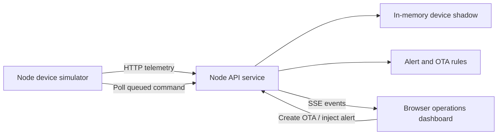
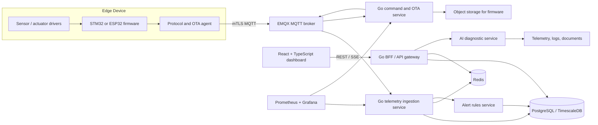

# CloudEdge AI Architecture

## Product statement

CloudEdge AI is a cloud-edge platform for connected industrial or robot devices. It gives an operator a reliable path from device telemetry to alerting, device control, OTA rollout, and evidence-backed AI diagnostics.

## First MVP: implemented in this repository



The MVP uses HTTP and in-memory state intentionally. Its goal is to prove the user-facing operational loop with a visible demo, not to imitate production infrastructure prematurely.

## Formal architecture after the MVP



## Domain model

| Entity | What it represents | MVP status |
| --- | --- | --- |
| Device | Device identity, type, firmware version, desired state | Implemented |
| Device shadow | Last reported/desired state and connection status | Implemented |
| Telemetry | Timestamped metrics such as temperature and vibration | Implemented in memory |
| Alert | Rule violation, severity, lifecycle, evidence | Implemented |
| Command | A desired action for an edge device | Implemented |
| OTA job | Firmware version rollout, progress, result | Implemented as command progress |
| Audit event | Who changed what and when | Next step |
| Tenant / organization | User and device isolation | Formal version |
| Diagnostic case | AI-generated fault explanation grounded in evidence | Formal version |

## Device message contracts

### Telemetry ingestion

```json
{
  "deviceId": "robot-arm-01",
  "timestamp": "2026-08-12T10:00:00.000Z",
  "metrics": {
    "temperatureC": 43.1,
    "vibrationMmS": 2.4,
    "batteryPct": 84,
    "motorRpm": 1260
  },
  "reportedState": {
    "mode": "auto",
    "firmwareVersion": "0.1.0"
  }
}
```

### OTA command

```json
{
  "id": "cmd_xxx",
  "type": "ota",
  "deviceId": "robot-arm-01",
  "payload": {
    "targetVersion": "0.2.0",
    "artifactUrl": "https://example.invalid/firmware/0.2.0.bin",
    "checksum": "demo-checksum"
  },
  "status": "queued"
}
```

## Priority roadmap

### Milestone 1: operational MVP

- Finish the current demo and record a 2-minute video.
- Add persistent JSON storage only if needed for the demo.
- Add command audit history and alert acknowledge/resolve behavior.
- Produce one architecture diagram and one API contract document.

### Milestone 2: formal backend and device protocol

- Port `server/domain/platform.js` behavior to Go/Gin.
- Add PostgreSQL migrations and Redis cache/rate limiting.
- Add EMQX and MQTT topic permissions.
- Replace the Node simulator with an ESP32 or STM32 telemetry/command agent.
- Add device identity, command idempotency, checksums, retry and resumable OTA.

### Milestone 3: observability and AI diagnosis

- Add Prometheus metrics, Grafana dashboard and structured logs.
- Add device log ingestion and a fault evidence timeline.
- Add RAG over datasheets/manuals and read-only diagnostic Tool Calling.
- Evaluate citation accuracy, tool-call success rate, latency and unsupported-answer rate.

## Project boundaries

- Do not claim large-scale device counts, a 72-hour run, real OTA success rates, ROS integration, or an AI diagnostic model until they are genuinely measured and documented.
- AI diagnosis must begin read-only. Any control action needs explicit human approval, audit logging and idempotency safeguards.
- The first real hardware integration should use one low-cost ESP32 board before moving to STM32/FreeRTOS.

