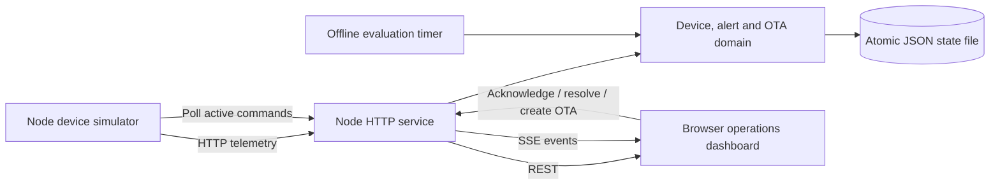
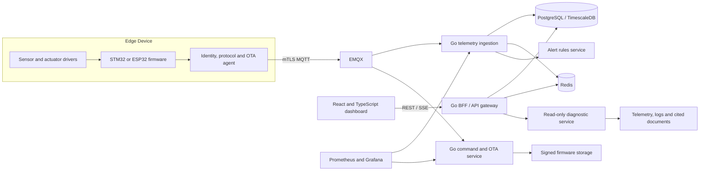

# CloudEdge Ops Architecture

## Product statement

CloudEdge Ops is a cloud-edge operations platform for connected industrial and robot devices. The current repository proves a reliable local path from telemetry to device state, evidence-bearing alerts, operator actions, OTA command delivery, persistent audit history, and realtime visualization.

## Implemented local architecture

The MVP intentionally uses Node.js, HTTP polling, SSE, and a JSON repository. The domain, HTTP transport, persistence, simulator, and UI remain separate so each can be replaced without changing the operational semantics.

## Runtime responsibilities

| Component | Responsibility |
| --- | --- |
| `server/domain/platform.js` | Device shadow, telemetry history, alert lifecycle, OTA state machine, events, snapshots |
| `server/persistence/json-file-repository.js` | Load state and atomically replace the local JSON state file |
| `server/http.js` | REST routing, validation, error mapping, SSE, and static asset serving |
| `server/index.js` | Compose runtime dependencies and schedule offline evaluation |
| `simulator/device-simulator.js` | Report telemetry, poll commands, acknowledge and advance OTA stages |
| `web/` | Multi-device operations UI and realtime status |

## Domain invariants

- Active OTA states are `queued`, `acknowledged`, `downloading`, and `installing`.
- Terminal OTA states are `success`, `failed`, and server-owned `expired`.
- Progress cannot regress; skipped stages and invalid terminal updates are rejected with `409`.
- Identical acknowledgement and progress retries do not duplicate history or events.
- Only one OTA command may be active for a device.
- Alerts move through `open`, `acknowledged`, and `resolved`.
- A manually resolved threshold alert can be triggered again as a new alert.
- An offline alert is deduplicated while active and automatically resolved when telemetry resumes.
- Every domain mutation is persisted before realtime subscribers are notified.

Detailed request/response behavior is in [API_CONTRACT.md](API_CONTRACT.md).

## Persisted state

The versioned snapshot contains devices, recent telemetry, alerts, commands including histories, and compact audit events. The default file is `data/platform-state.json`; it is intentionally ignored by Git.

Writes first prepare a same-directory temporary file, rotate three backups, copy the committed primary into the newest backup, then atomically replace the primary. The primary remains available if replacement fails. Startup validates the primary then each backup and migrates v1 snapshots to schema v2. If no valid snapshot exists, startup fails explicitly. This supports one local demo process; it does not provide multi-process locking or power-loss durability guarantees.

Persistence failure rolls back in-memory state and suppresses subscriber events. Health becomes degraded until a successful save. Offline and expiry scheduler errors are caught so transient storage failures do not terminate the process.

## Formal architecture after the MVP

This diagram is a roadmap, not an implementation claim.

## Next milestones

1. Add private read access, credential rotation, pagination and audit retention.
2. Add Docker Compose with PostgreSQL and MQTT after measuring the local implementation.
3. Integrate one ESP32 device with a verified firmware transport before STM32/FreeRTOS work.
4. Add read-only, evidence-backed diagnosis after collecting real operational evidence.
5. Consider a Go/React migration only when justified by measured requirements, preserving contract tests.

The v0.3 release implements backup rotation, schema migration, optional write credentials, receive timestamps, rate limits, command expiry and health metrics. See [IMPROVEMENT_PLAN.md](IMPROVEMENT_PLAN.md) for acceptance gates.

## Boundaries

- Do not claim production scale, measured uptime, real OTA reliability, hardware integration, or AI accuracy without evidence.
- AI diagnosis must not issue control commands. Future control actions require explicit human approval, authorization, audit logging, expiry, and idempotency.
- Real OTA requires signed artifacts, checksum verification, rollback, retry, resume, and secure device identity.
